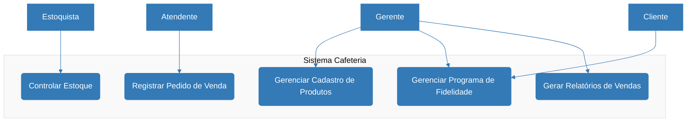

# Diagrama de Caso de Uso - Sistema Cafeteria

```mermaid
%%{init: {'theme': 'base', 'themeVariables': {'primaryColor': '#337AB7', 'primaryTextColor': '#FFFFFF', 'primaryBorderColor': '#337AB7', 'lineColor': '#337AB7', 'secondaryColor': '#FFFFFF', 'tertiaryColor': '#F9F9F9'}}}%%
graph TD
    subgraph Sistema Cafeteria
        UC1(Gerenciar Cadastro de Produtos)
        UC2(Controlar Estoque)
        UC3(Registrar Pedido de Venda)
        UC4(Gerenciar Programa de Fidelidade)
        UC5(Gerar Relatórios de Vendas)
    end

    ActorGerente[Gerente]
    ActorEstoquista[Estoquista]
    ActorAtendente[Atendente]
    ActorCliente[Cliente]

    ActorGerente --> UC1
    ActorGerente --> UC4
    ActorGerente --> UC5

    ActorEstoquista --> UC2

    ActorAtendente --> UC3

    ActorCliente --> UC4
```
